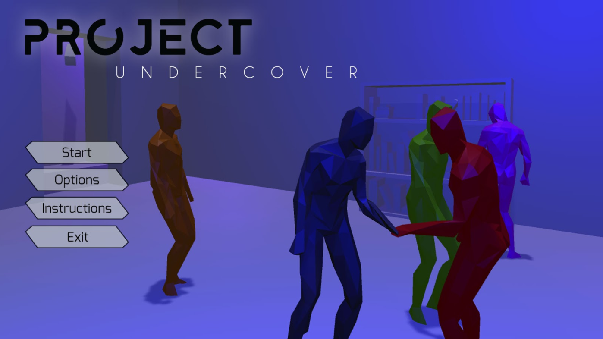
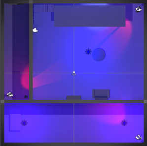
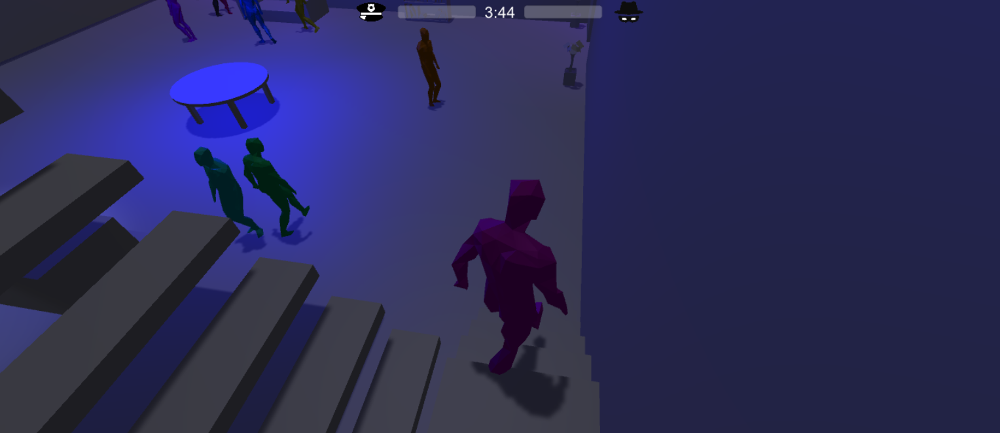
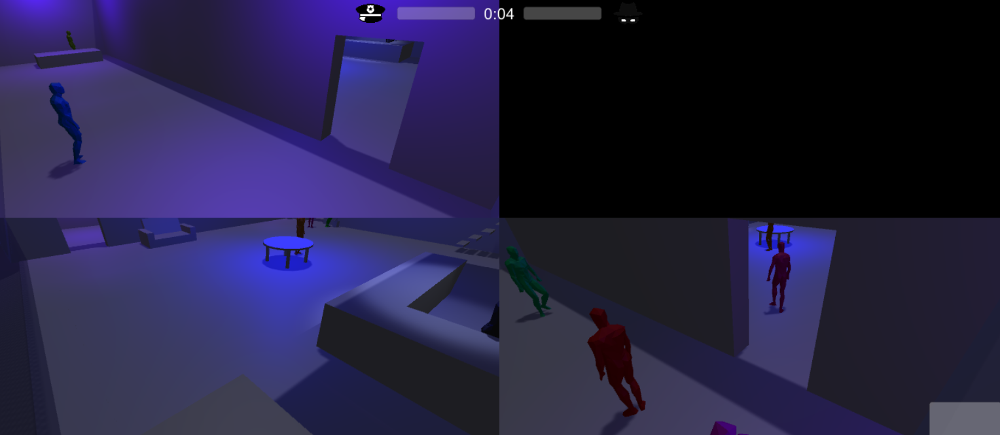
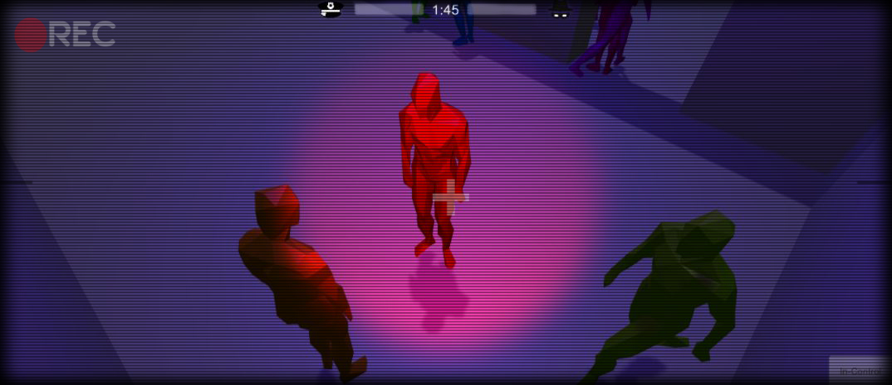
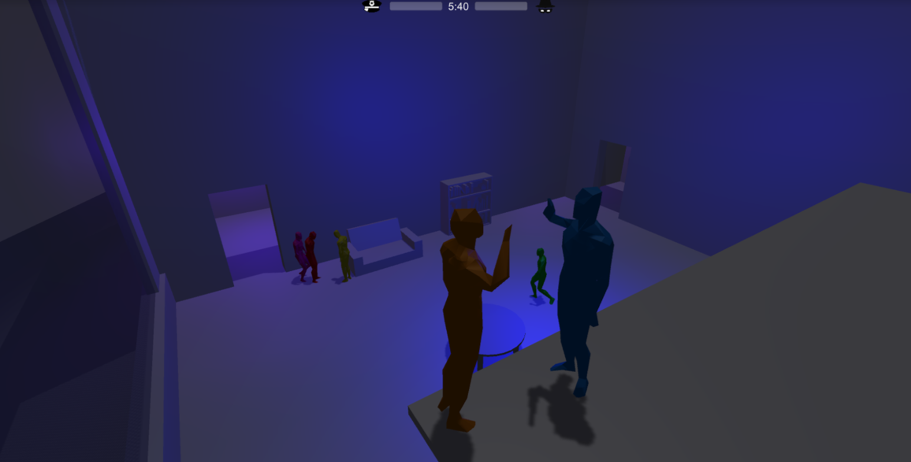
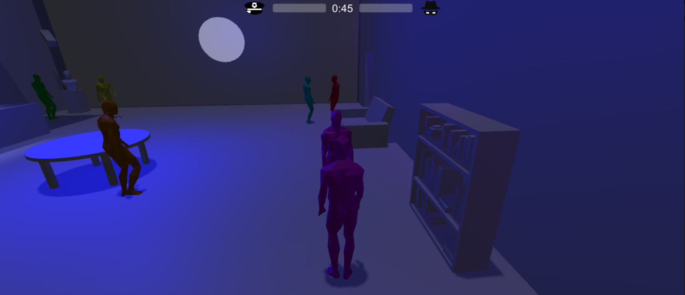
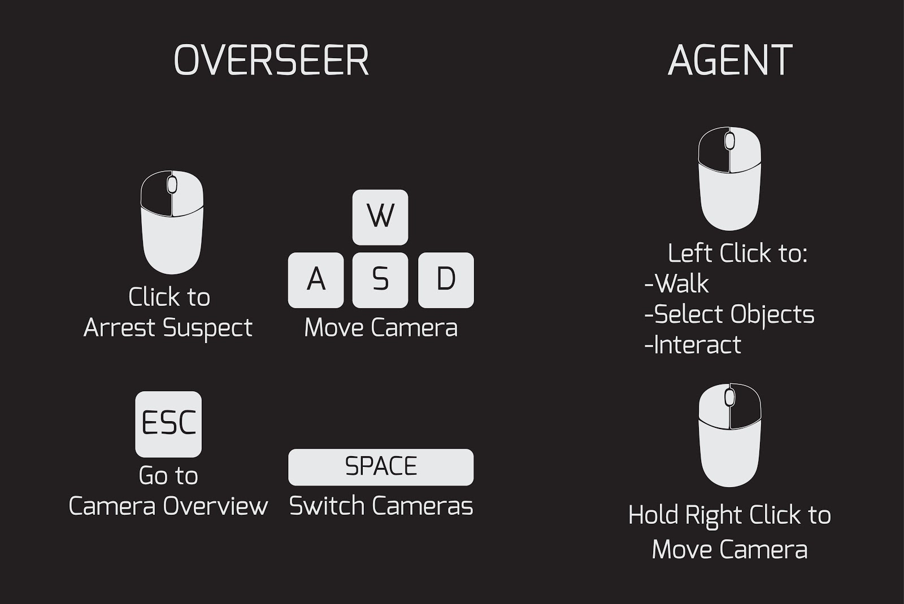

*NOTICE: The source for this repository is private since we paid for a few character models, but we're not sure about licensing around sharing those assets publicly.*

# Project Undercover

_Based on Spy Party and Mafia_

### Developers

* Alex Huddleston - Management & Music
* Caleb Perkins - Design
* Darrel "Camera Man" Marek - Camera & Unity
* Randall "Bad Man" Dolifka - Github & Music
* Steven Garret George "Gravy" "I Feel This" "Electroman" "Spicy But Not Hot" "Goob" "Caleb's Side Chick" "Test" - The Sixth Spice Girl

We are also aided by:

* Carolyn Stocki - Art Director
* Puneet Kohli - Teaching Assistant
* Soumitra Goswami - Teaching Assistant

# What is Project Undercover?
Project Undercover is a game about pretending to be an AI. Or at least -- that's part of it. Players will compete against one another, with one side trying to blend in with a crowd of non-player characters, and the other side attempting to identify them. It takes place at a party, and the undercover players are agents trying to infiltrate and complete several missions before the guard, or overseer, catches them. The overseer is limited by a set of cameras, and slowly receives information over the course of the game to help identify the agents, thus putting the heat on them.

It is designed to be a fast-paced party game with a standard session lasting somewhere around 15 minutes, subject to playtesting.

# Overview

## Multiplayer asymmetric party game
* Asymmetric - players play the same game in fundamentally different ways

## Two teams:
* Spies (1-3 players)
* The Security Guard (the audience)
    * At least 2:1 ratio of audience observers to spies to recommended

## The Spies:
* 1-3 players are Spies
* Attending a party of AI guests
* Spies must discreetly complete a series of missions without being caught
* Essentially have to pretend to be an AI guest to blend in with the crowd

## The Security Guard
* Played by the audience
* everyone who is not a spy
* Have to identify and arrest the spies
* Look for suspicious behavior through security feeds of the room

## Win Conditions
* Spies
    * Complete all of the missions without being caught by the guard
    * Fool the guard into arresting an AI guest

* Guard
    * Arrest all of the spies before they complete their missions

## Potential Spy Missions
* Poison someone’s food/drink
* Replace a piece of art with a bugged replica
* Exchange a secret message with one of the other spies

## Guard Game Mechanics
* Selectively zoom into any of the camera feeds for a closer look or to change the camera orientation
* Mark suspicious targets for closer observation

# Screenshots

